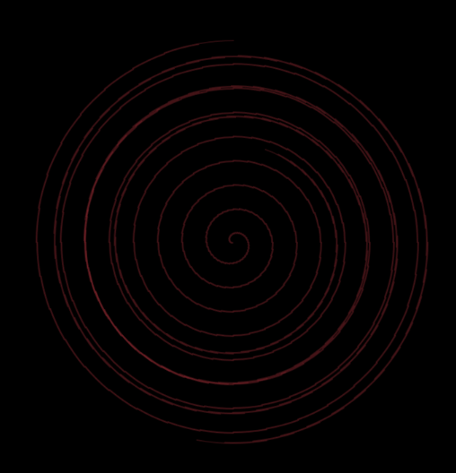
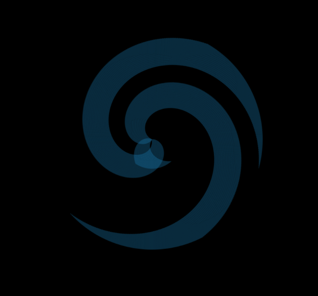
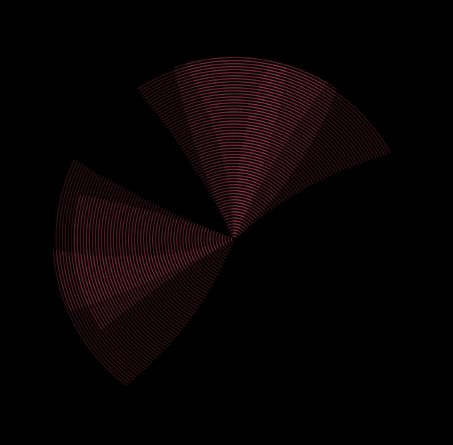
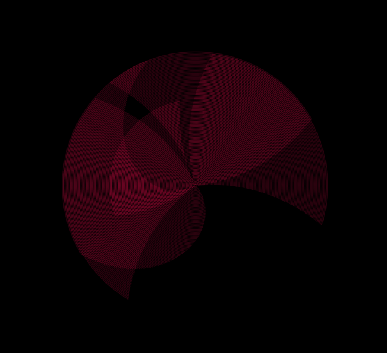

# mini_ex3
*Mark Staun Poulsen*

[Enjoy!](https://rawgit.com/Mmarksp/Aesthetic_Programming_2018/master/mini_exercises/mini_ex3/mini_ex3_index.html) Use the mouse to skip to a new shape.

## skip this
Phew. Not a very academic term, but it had it coming. To put my week into perspective, I spent the friday session of "Shut Up and Code" staring at my screen, trying out corrections, ideas and intense walkthroughs of my browser console in order to just get started on the assignment. I left the class that having made no progress. I had made progress in learning about coding. Or so I thought. Nah, hammering my head against a wall this weekend, now writing this message at 01:23 after having finished the program, I can say that I have indeed learned a lot.

## (im)proper presentation - what I mean is that you can skip this
In this program I have taken the concept of the throbber and implemented it in a meditative and continuous idea for a program. My program is essentially use of arrays, initial inspiration from last class (especially from the impressive Asterisk Painting) and the most important contribution of all, sheer dumb luck. I actually had an idea of making a sort-of radar that would expand itself (like my circle figure in this program) and highlight different shapes I had hidden in the vast void of background(0). I could not figure out how random() worked. Nor could I figure out how arrays worked. In the end I wrote a badly organized code, where I had some expansion, one slightly open arc, a pinch of colours, a tiny bit of rotation and there you go: one very flabbergasted student letting out a high-pitched noise I suppose constitutes excitement and surprise in one go.

My code uses pre-set parameters within the arrays to determine very important factors for the rendering of the drawing function. Therefore, **I** have determined how it can go about this, and I would encourage others, and a future uninspired me, to pick this code up again in order to experiment and explore, what other parameters can be added, and how the conditions for the current ones can be altered. There are many possibilities. However, I am very happy that I have been able to organize this within arrays. It ultimately means that the code is easier to look at, and I have also managed to implement a bigger selection of cool shapes through determinable parameters that are a very soothing to look at.

I have a few things I want to address. I want to deal with how the animation can either almost be stuck (very low rotationSpd), or fill out the canvas too fast (very high rotationSpd) - (or at least I think that is the problem). I also originally wanted a more smooth experience. While it is certaintly smooth to be able to click and run the program again, I actually wanted three circles on the screen, each working with different parameters from the same arrays. They should further be able to initiate one another so as to have a continuous cycle of shapes. This I think would lead nicely to me talking a bit about the theme of this mini_ex. The throbber.  

## In all seriousness, this is actually the written explanation for the assignment  
Ok. My time-related function/syntax? I suppose my immediate answer would be a use of frameCount. This is certaintly an indication of time, and it can be used for such a purpose in other programs. However, in my programs it would have been just as useful to have something else as well. No, my idea with this program, and why there even is an aspect of time in this, is that it is a "developing shape".  
Btw this is not a technical term, but I don't care. This developing shape is quite similar to pause screens found in earlier Windows. Remember? I am thinking about the one with all the pipes that is also continuously building and developing itself. I also remember as a child that I could stare at that screen and completely immerse myself in that building process.  
My time-related function is then in how the effect of this rendering that I have created is a sort of narrative, a building narrative. It is repeatedly building itself, inward and outward, laying coloured shapes out on top of previous shapes. As such, this narrative is a timeline, and with the added interaction of rendering a new shape through a mouse click, the potentiality for an entertaining and also long pause created by this throbber idea is maybe good.

This throbber is certaintly a little different than the standard edition. That may be a good thing. The original throbber is a cultural concept, it is internet culture illustrated through an animation. It is also a passage way into real-time data streams and the complexity of micro-temporality. Large concepts, I know, I know. Anyway, behind the throbber icon a complex reality lies. Data distribution is not just as neat and timely as any streaming session on Netflix would make you believe. Instead, data is often uploaded and distributed in an almost sporadic sense, where the internal logics of the computers, the live queries, data centers and such conepts work within a reality obscured by the comfort of playback. When we then encounter the throbber icon in our daily goings, we may just realize that it can be seen as this indication of the existence of the very complex micro-reality.
