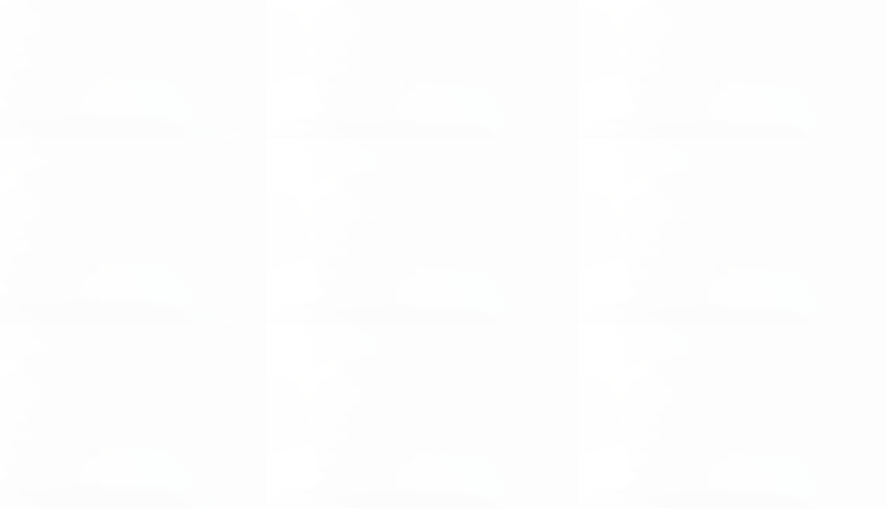

# mini_ex4
*Mark Staun Poulsen*

[Hell yea! Just speak up, take down the system!]()  
Also... this program makes your computer quite warm. If you have multiple things running, I suggest you close some of them down.

## My experience with this mini_ex
For this week I had to explicitly add intentions behind my work other than that of experimenting, investigating, failing, becoming frustrated, figuring out solutions, becoming less frustrated, adjusting my expectations to my code, and then ultimately producing something I think has a few cool qualities here and there. For the previous weeks I have been able to track the leaps I have taken in coding, which has been incredible.  
However, for this week I am less excited about what I have come up with. While I may have ventured into Object Oriented Programming, used commands for data capture and even mapped the transparency of the background colour to the input of the microphone, I have also been very dependent on Schiffman's videos, Winnie's code structure for data capture, and some references and examples from the p5 website. This is not necessarily bad, but I will stress that even now after having produced this, I would not be able to produce something similar, and in this process I have not been that original in my work either. But that is fine. I still do not really grasp the practical aspects and the logic of properly using classes, and as such this is simply something I will need to practice.  

## My program
My program is first of all capturing video and audio input. In technical terms, I have initiated a capture feed, then hidden the capture, and finally referenced the capture feed in the rendering of a bunch of images. This bunch of images is further drawn using a nested loop within a loop that collectively determines an initial x-value and then all of the possible y-values in that specific "x-value column", before moving on to a new x-value and repeating the process again. I have also captured audio. The audio input is then mapped to also determine the alpha-value of the background colour. It is mapped in a way so that the alpha value is lowered as the input level is getting higher.  

The result is ultimately an interactive program that always captures your video input, but is not itself visible to the user. Even after speaking, the visibility is still very low. What I have attempted to (I suppose) comment on or criticize is the lack of transparency for the user in interacting with invisible data streams. In this sense, the multiple images are supposed to spook the user in their many renderings. I suppose I would like for it to be interpreted as if there are many eyes looking at you in the data streams. Eyes that you do not control, you may not even be aware of their existence, and those eyes are ultimately themselves in control. They may even be controlling you. Ultimately they are surveilling you, and you are not surveilling them. You do not get to say anything. By then adding the audio input as the interaction, I would highlight how ineffective and small our voices can seem in this new battlefield for power through data. Using your voice here gets you a brief glimpse into the capture feeds, but in the end you do not have the capacity to fully see the renderings. Just speaking up becomes rather ineffective. Does this capture real life? It can certaintly feel that way.  

## Capturing data with new hardware
Writing this program, I have come to reflect on how important hardware is in this process. It is true that trackers, analytics, hackers watching you through your webcam, are using software, but software is dependent on hardware. Using the capture feed, I notice how my camera is very weirdly located on my laptop, and when I experimented with the camera tracker, my camera made it very difficult to use the tracker for anything worthwhile. Hardware is ultimately our access to software, and if anyone takes that away, what can we then do? If I went over to use my desktop, I would have no webcam. This would make the program useless. Governments and corporations have the option to heavily invest in and further develop hardware. It is through this large scale investment in technology that software is able to expand along an expansion of hardware - into VR, 3D printing and also into capturing data in new ways. In our increasingly digitalized society, where so much data is captured already, further proliferation of technology capable of tracking and capturing must be considered carefully. In the end, the proliferation is unavoidable, but perhaps speaking up, informing people, pushing for change and proper reflection can make the transition result in something better for everyone?  
And then what is exactly better for anyone? I do not think this relationship between invisible data streams and unknowing users is a good start.
